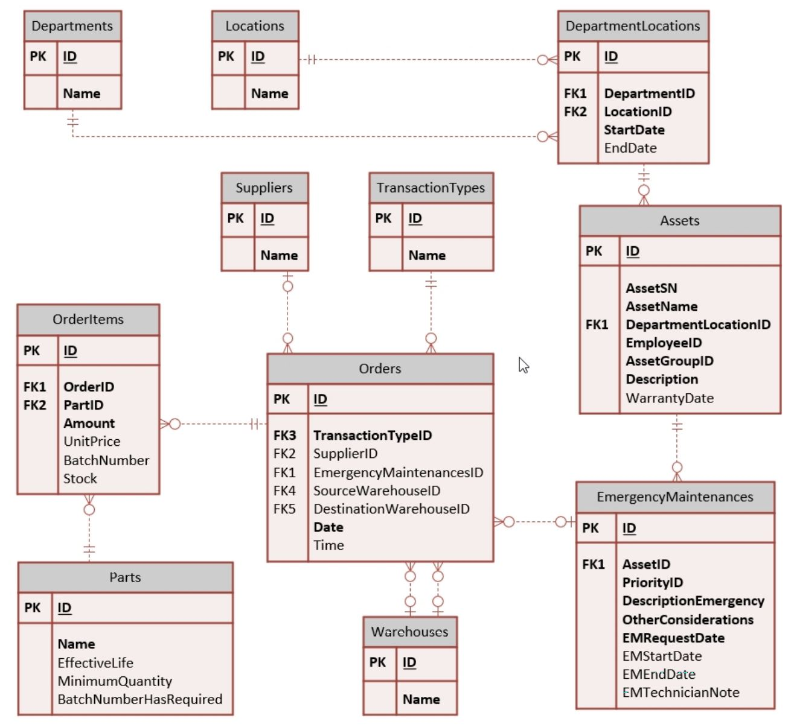
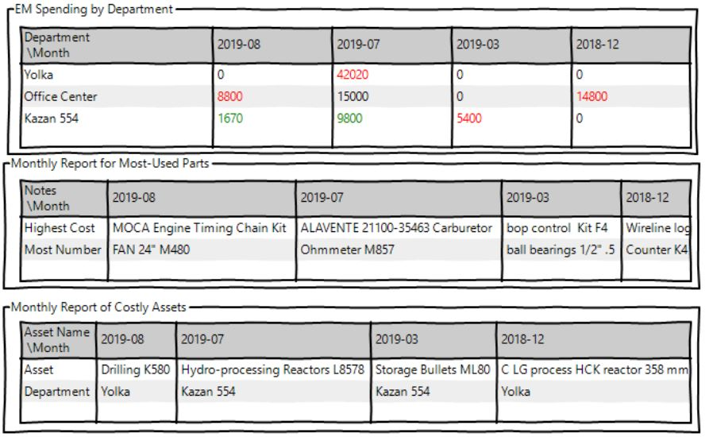

# Java Backend Project
- Web Server : Apache Tomcat  
-  : Java Servlets  
- Database : mariadb (mySQL)  
- ERD

- Web APIs  
각 API는 모두 EM이 완료된 것만 집계  
    1. 월별 각 부서에 사용된 긴급 유지보수 사용 비용
    2. 월별 사용된 부품 비용, 횟수
    3. 월별 가장 많은 비용이 들어간 자산
    4. 월별 가장 많은 비용을 사용한 부서

